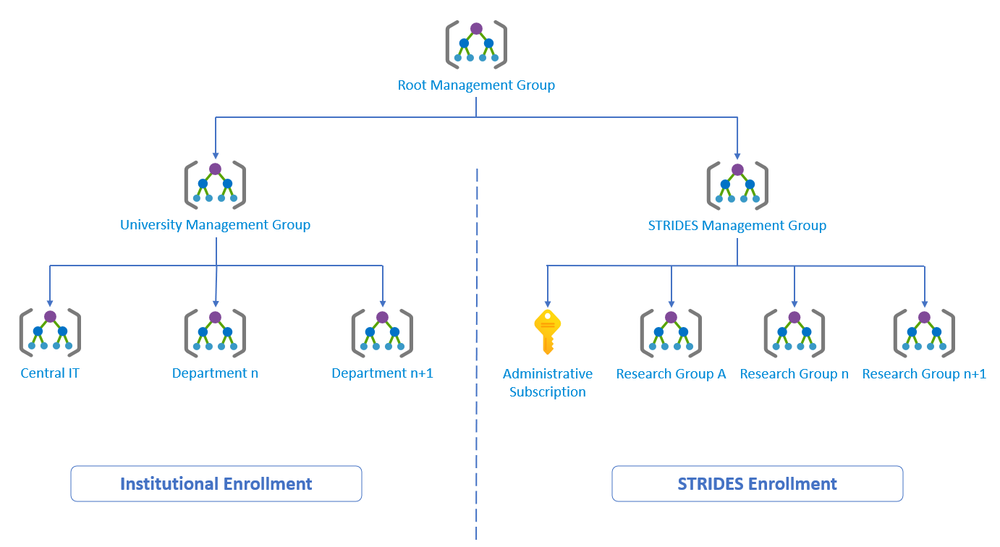
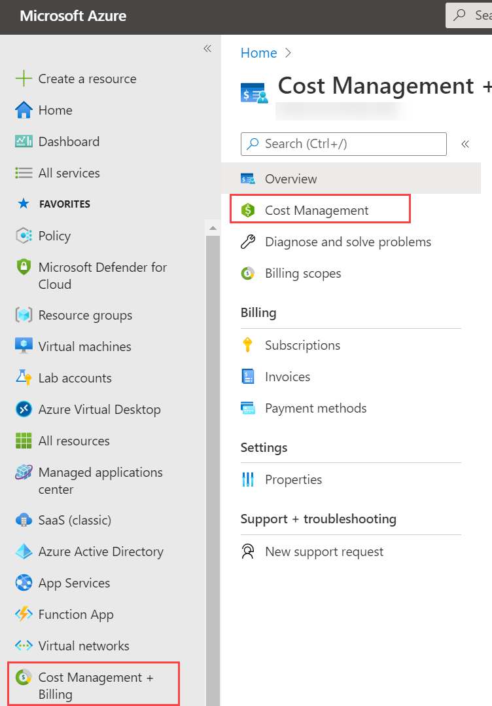
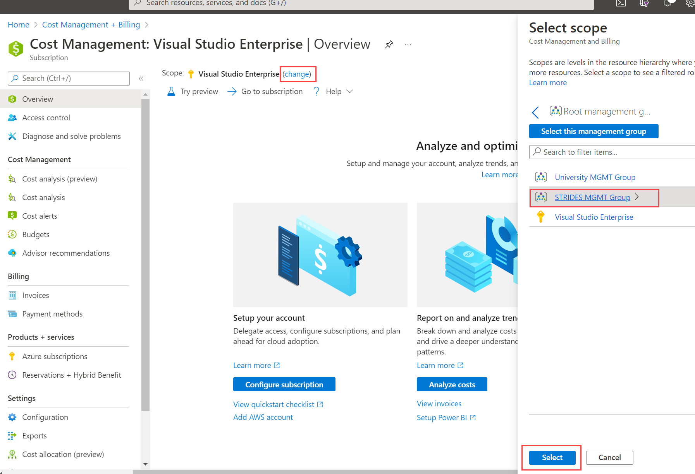
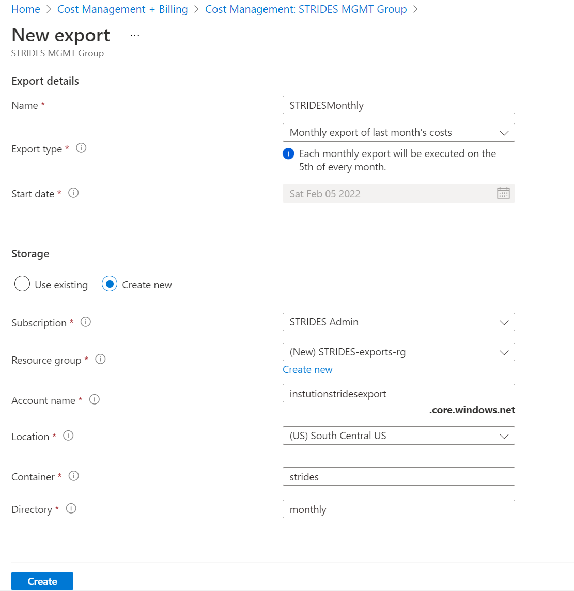

# Overview
All extramural NIH STRIDES environments are required to report their utilization and cost to NIH monthly so that NIH may audit discounts and report to congress. This document provides instructions on automating the reporting to ensure your NIH STRIDES environment remains compliant. 

## Prerequisites:

- [All STRIDES Azure Subscriptions must be isolated within their own Management Group](#STRIDES-Management-Group)
- [A reporting Azure subscription](#STRIDES-Reporting-Subscription)
- [Permissions](#Permissions)
- [Enrollment Number](#Enrollment-Number)
- [Naming Convention](#Naming-Convention)

## Tasks:

1. [Create an Azure Cost Management Export](#Create-a-Cost-Management-Export)
1. [Use Azure Data Share to Push Data to NIH](#Use-Azure-Data-Share-to-Push-Data-to-NIH)


# STRIDES Management Group

A [Management Group]( https://docs.microsoft.com/en-us/azure/governance/management-groups/overview) isolating STRIDES workloads from all other institutional workloads is required so that STRIDES workloads do not co-mingle with unrelated workloads. This will enforce an isolation of cost, policy, permissions, and reduce complexity for reporting and maintenance.

Below is an example of a potential management group hierarchy. Your management group hierarchy does not need to align exactly with the example, its intent is merely to illustrate the separation of all STRIDES-related workloads within the STRIDES enrollment into its own Management Group:



Creating a management group is a simple and well documented process:
- [What are Azure management groups?]( https://docs.microsoft.com/en-us/azure/governance/management-groups/overview)
- [Quickstart: Create a Management Group]( https://docs.microsoft.com/en-us/azure/governance/management-groups/create-management-group-portal)

# STRIDES Reporting Subscription

A single reporting subscription within your STRIDES enrollment & management group is required in order to host the resources and logic to report cost and utilizations to NIH.


<s> > **_Note:_**  Like all STRIDES subscriptions, you must first seek NIH approval by filling out the [Subscription Provisioning Form](../subscription%20provisioning/README.md).</s>
> **_Note:_** NIH Approval is no longer required.


Once you have received approval from NIH, creating the reporting subscription is no different than creating any other Azure subscription. Documentation on creating a new EA subscription [can be found here](https://docs.microsoft.com/en-us/azure/cost-management-billing/manage/create-subscription). 

Requirements for the Reporting Subscription:
- Must reside within your STRIDES enrollment
- Must reside within your STRIDES Management Group
 
> **_Note:_** Since all EA subscriptions default to the same name ("Microsoft Azure Enterprise") it is strongly recommended that you immediately change the name to something unique and meaningful (e.g. "STRIDES - Reporting")

# Permissions

To successfully set up STRIDES reporting, you will need the **Owner** role in the *Reporting Subscription* and the **Cost Management Contributor** role for the *STRIDES Management Group.*

# Enrollment Number

The Azure STRIDES initiative requires an Azure Enterprise Agreement [Enrollment](https://learn.microsoft.com/en-us/azure/cloud-adoption-framework/ready/landing-zone/design-area/azure-billing-enterprise-agreement). It is likely that your institution may have more than one Azure Enterprise Agreement Enrollment. NIH mandates that you use the **STRIDES** Enrollment number for reporting. If you are unsure which Enrollment Number is associated with your STRIDES environment, please reach out to your institution's Azure administrator, or your Microsoft account team. 

# Naming Convention

NIH requires strict naming conventions for all reporting objects and subscriptions so that they may reliably identify cost by institution & grant. 

For references to **STRIDES-Institution-Name** below, please substitute it with your Azure **STRIDES** Enrollment follolwed by your institution's domain name, replacing all instances of periods (".") with hyphens ("-".) 

**Example:**
   | **STRIDES** Enrollment Number  | Domain Name | STRIDES-Institution-Name | 
   | ------------- | ------------- | ------------- |
   | 00000000  | azure.edu  | 0000000-azure-edu  |
   | 00000000  | department.azure.edu  | 0000000-department-azure-edu  |

For references to **STRIDES-Share-Name** below, please append "-share" to your **STRIDES-Institution-Name**.

**Example:**
   | STRIDES-Institution-Name  | STRIDES-Share-Name | 
   | ------------- | ------------- |
   | 0000000-azure-edu  | 0000000-azure-edu-share  |
   | 0000000-department-azure-edu  | 0000000-department-azure-edu-share |


# Create a Cost Management Export

Azure Cost Management provides the ability to automatically schedule an export of your STRIDES environment's cost and utilization into an Azure Storage Account within your STRIDES Reporting Subscription.

1. From the Azure Portal, click on **Cost Management + Billing**, then **Cost Management**.

    

1. Ensure your scope is set to your STRIDES Management group. If not, click **Change** next to your current scope, drill down until you see your STRIDES management group and select it. 

    


1. Click on **Exports** from the middle blade and follow the detailed instructions in the following link with these parameters.

    Link: **[Tutorial: Create and manage exported data](https://docs.microsoft.com/en-us/azure/cost-management-billing/costs/tutorial-export-acm-data?tabs=azure-portal)**


    | Field Name  | Recommended Value |
    | ------------- | ------------- |
    | **Name**  | STRIDESMonthly  |
    | **Export Type**  | Monthly export of last month's cost  |
    | **Start Date**  | Default  |
    | **Storage**  | Create new  |
    | **Subscription**  | Your **STRIDES** Reporting Subscription  |
    | **Resource group**  | Create new Resource Group called "STRIDES-exports-rg"  |
    | **Account Name**  | Globally unique and meaningful alphanumeric name  |
    | **Location**  | Azure Region closest to your institution  |
    | **Container**  | **STRIDES-Institution-Name** |
    | **Directory**  | exports  |

    


# Use Azure Data Share to Push Data to NIH

Azure Data Share is a fully-managed, zero overhead service that enables organizations to simply and securely share data between Azure environments. 

It uses an invitation system to connect a data provider to data consumer and allows for the movement of data from provider to consumer without the need for developing complex pipelines, sharing secrets, or granting access.

More information on Azure Data Share [can be found here](https://docs.microsoft.com/en-us/azure/data-share/overview).

1.  [Create an Azure Data Share Account](https://docs.microsoft.com/en-us/azure/data-share/share-your-data-portal#create-a-data-share-account) in your **STRIDES-exports-rg** resource group.
 
1.  Create a Share within the Data Share Account with the parameters as defined below.

    [Create Share documentation](https://docs.microsoft.com/en-us/azure/data-share/share-your-data-portal#create-a-share)

    **Details**
    | Field Name  | Recommended Value |
    | ------------- | ------------- |
    | **Share name**  | **STRIDES-Share-Name** |
    | **Share type**  | Snapshot  |
    | **Description**  | STRIDES Monthly Export<br/> Enrollment Number: 00000000<br/> Institution: institutionName |

    **Datasets**

    Choose the storage account and container that was created to store your monthly [cost management exports](#Create-a-Cost-Management-Export).

    **Recipients**

    Leave recipients blank

    **Settings**

    Enable **Snapshot schedule** with **Recurrence** set to *Daily*


1. Invite the NIH to consume your data by executing the following PowerShell command in [Azure Cloud Shell](https://docs.microsoft.com/en-us/azure/cloud-shell/overview):

    ```powershell
    New-AzDataShareInvitation
   -ResourceGroupName STRIDES-exports-rg
   -AccountName <Your Share Account Name>
   -ShareName <Your STRIDES-Share-Name>
   -Name <Your STRIDES-Share-Name>
   -TargetObjectId <Provided by Microsoft NIH STRIDES Team>
   -TargetTenantId <Provided by Microsoft NIH STRIDES Team>
    ```
To receive the TargetObjectId & TargetTenantId above, please [reach out to the Microsoft STRIDES Team](mailto:MSSTRIDES@microsoft.com).
